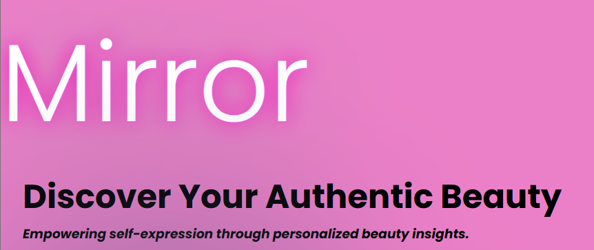
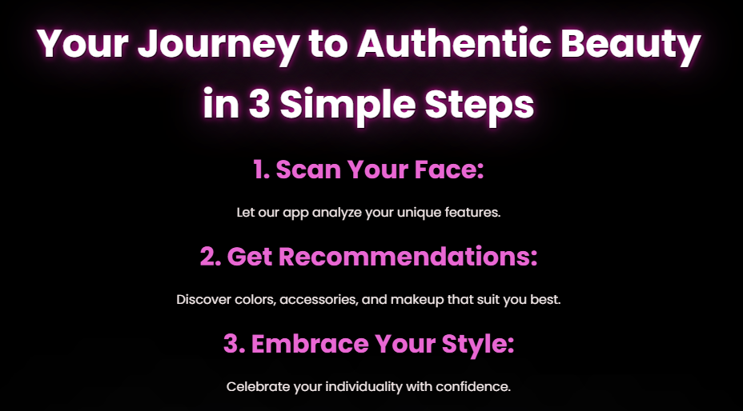

# Mirror

This is a Flask project with DeepAR integration, built with Reactjs
* All Makeup looks used in this project that are associated with Licensed Make Up Labels are custom built based on hexcode color matching. At this time there is no association with these Brands and this projects. Colors are not exact matches but estimates and there is no guarantee that the color is an exact match.

# Features

* Flask backend with structured custom API
* DeepAR SDK Integration
* PostgreSQL preloaded database
* Custom DeepAR effects built with face, lip, and eye models
* Camera functionality for Desktop and Mobile
* Redux integration for single page rendering

# Getting Started
* This Project requires a DeepAr Account to access effects and ar    features
1. Clone the repository.

2. Install dependencies.

   ```bash
   pipenv install -r requirements.txt
   ```

3. Create a __.env__ file based on the example with proper settings for your
   development environment.
* Make sure to place your deepar license key inside the app.
* For details on how to use DeepAR or obtain a license key visit:
   https://docs.deepar.ai/

4. Make sure the SQLite3 database connection URL is in the __.env__ file.

5. This project organizes all tables inside the `flask_schema` schema, defined
   by the `SCHEMA` environment variable.  Replace the value for
   `SCHEMA` with your schema name (snake_case)

6. Run virtual env, create migrations if they dont exist, and seed database:
   Flask app:

   ```bash
   pipenv shell
   ```

   ```bash
   flask db upgrade
   ```

   ```bash
   flask seed all
   ```

   ```bash
   flask run
   ```

# How it works
* Personalized AI-driven facial scanning and beauty suggestions.
* Augmented reality for real-time try-ons.
* Customizable makeup filters for instant transformations.

Mirror uses advanced facial scanning, AI, and AR to provide tailored recommendations for accessories, colors, and makeup that complement your natural features. We’re here to help you look and feel like your most authentic self.

To Try the mirror simply click on Take a Look on the homepage and explore our virtual makeup experience.

# Live Server
https://mirror-ibwn.onrender.com

# Resource Links
https://docs.deepar.ai/
https://www.shopar.ai/
https://www.d5render.com/workflow/blender?utm_campaign=bingsearchFUS2blender&utm_source=bing&utm_medium=cpc&msclkid=434ddebaa0a81995f10cb97f7c7d4ed0
https://www.blender.org/
